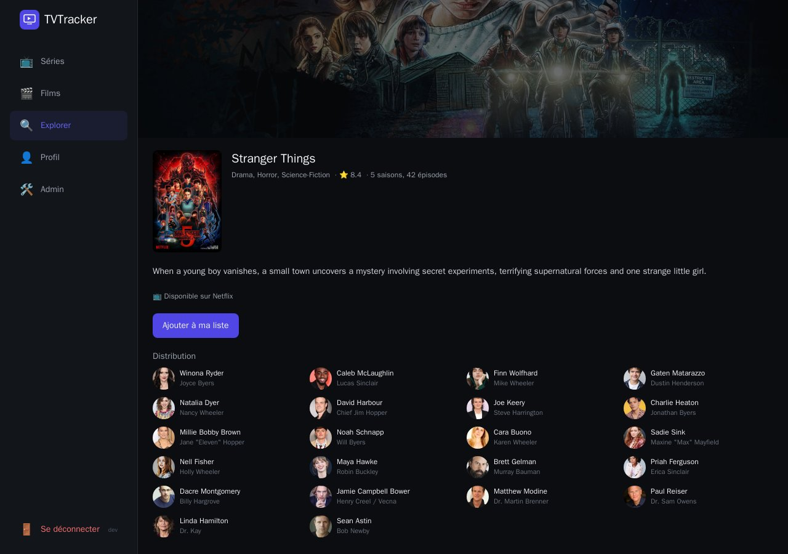
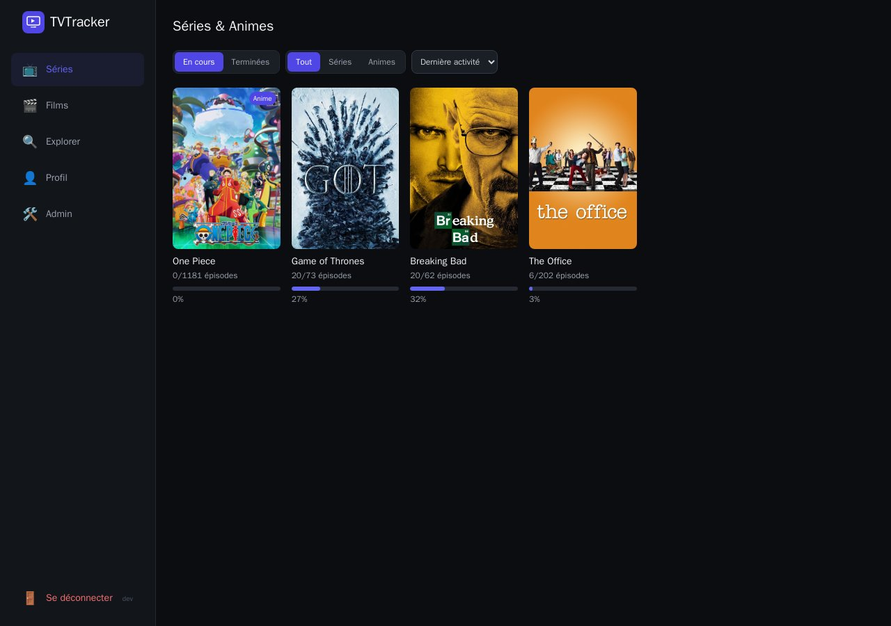
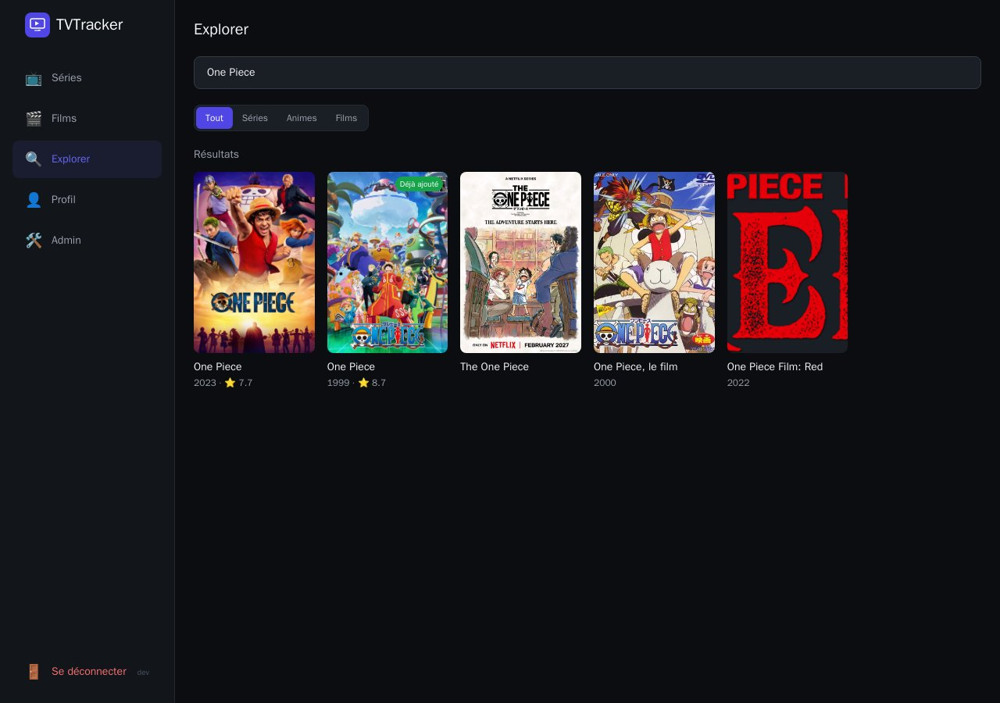
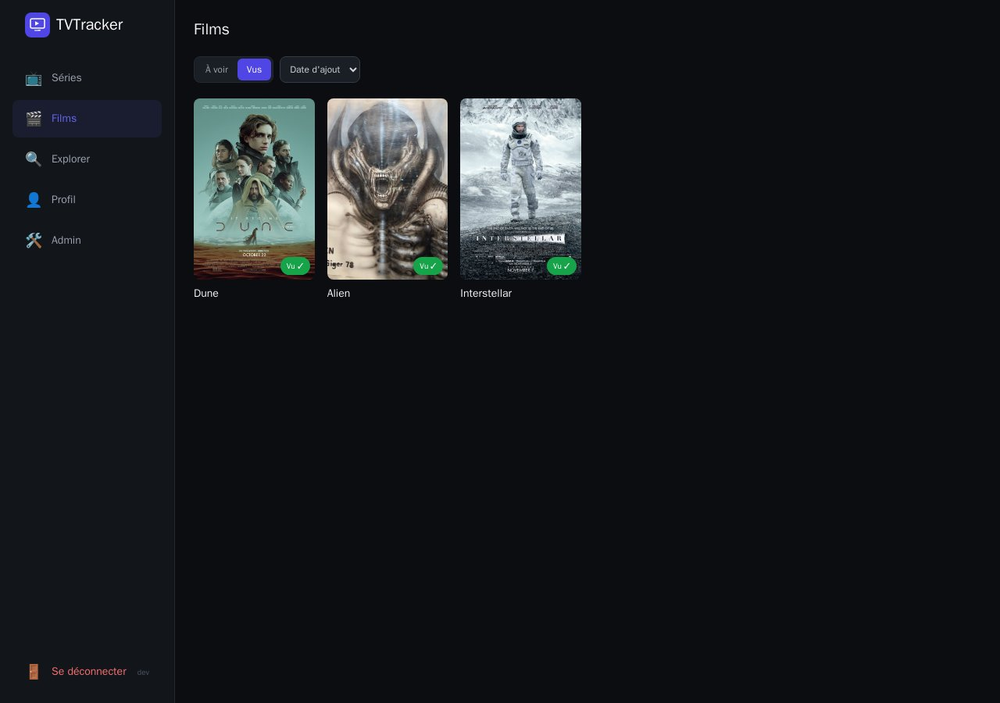
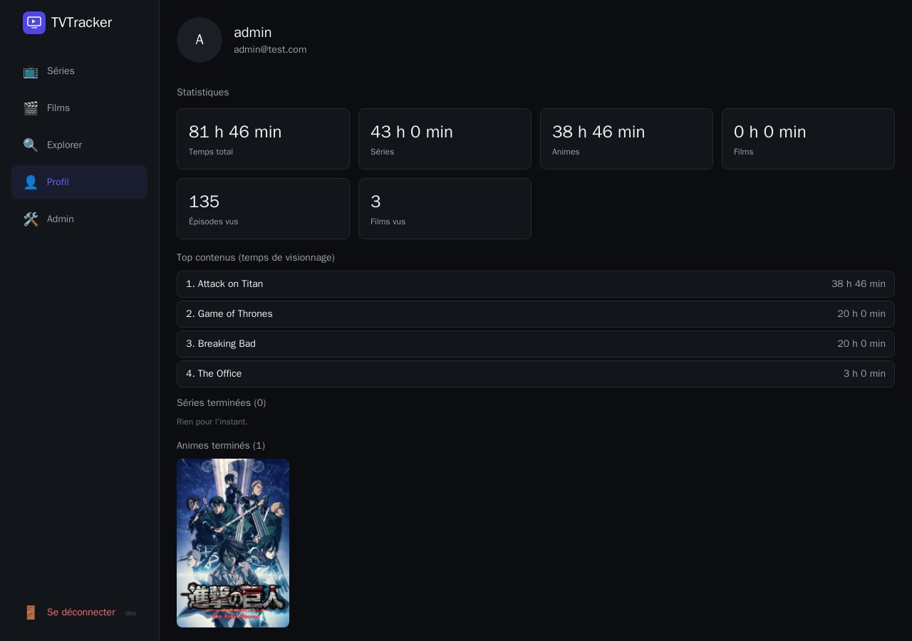

<p align="center">
  
</p>

<h1 align="center">TVTracker</h1>

<p align="center">
  Le suivi de séries, animes et films — épisode par épisode, entre amis, auto-hébergé.
</p>

<p align="center">
  <b>Zéro clé d'API</b> · <b>Un seul conteneur Docker</b> · <b>Mise à jour automatique à chaque push</b>
</p>

<p align="center">
  
</p>

## Pourquoi

Les trackers grand public poussent vers un abonnement et demandent une clé d'API rien que pour afficher une affiche. TVTracker fait l'inverse : un `docker run`, un compte admin, et vos amis s'inscrivent — leurs données restent sur votre serveur, point final.

## Ce qu'on y fait

<table>
<tr>
<td width="50%">

**📺 Séries & Animes**
Cochez un épisode ou une saison entière en un clic, suivez votre progression, filtrez en cours / terminées.

**🎬 Films**
Liste à voir / vu, note personnelle, bascule instantanée.

</td>
<td width="50%">

**🔍 Explorer**
Recherche en temps réel, tendances du moment, distribution complète avec photos, badge « Déjà ajouté ».

**👤 Profil**
Temps de visionnage total, top contenus, import de tout votre historique TV Time en un fichier.

</td>
</tr>
</table>

<p align="center">
  
  
</p>
<p align="center">
  
  
</p>

Interface mobile-first (navigation en bas d'écran sur téléphone, sidebar sur desktop), thème sombre.

## Démarrage rapide

```bash
docker run -d --name tvtracker -p 3000:3000 \
  -e JWT_SECRET=$(openssl rand -hex 32) \
  -e ADMIN_USERNAME=admin -e ADMIN_EMAIL=admin@exemple.com -e ADMIN_PASSWORD=changez-moi \
  -v tvtracker_data:/data \
  ghcr.io/estemobs/tvtracker:latest
```

L'application est sur **http://localhost:3000**. Le compte admin est créé automatiquement au premier démarrage ; vos amis s'inscrivent ensuite et apparaissent dans l'onglet Admin pour validation.

Ou avec Docker Compose, en clonant le dépôt :

```bash
git clone https://github.com/Estemobs/tvtracker.git && cd tvtracker
cp .env.example .env      # puis éditer : JWT_SECRET, ADMIN_*
docker compose up -d --build
```

Chaque push sur `main` republie l'image sur GHCR ; sur un serveur lancé avec [`docker-compose.prod.yml`](docker-compose.prod.yml), Watchtower la récupère toute seule au bout de quelques minutes — aucune mise à jour manuelle à faire.

### Variables d'environnement

| Variable | Rôle | Requis |
|---|---|---|
| `JWT_SECRET` | Signature des sessions — générer avec `openssl rand -hex 32` | ✅ |
| `ADMIN_USERNAME` / `ADMIN_EMAIL` / `ADMIN_PASSWORD` | Compte admin initial | ✅ |
| `PORT` | Port HTTP exposé | non (3000) |

## Un catalogue sans clé d'API

| Contenu | Source |
|---|---|
| Séries & animes | [TVmaze](https://www.tvmaze.com/api) — recherche, fiches, saisons/épisodes, notes |
| Films — recherche | [Wikipédia](https://fr.wikipedia.org) |
| Films — tendances | [iTunes](https://itunes.apple.com) |

Compromis assumé : certains films n'ont pas de durée ou de note publique selon la source — c'est le prix de l'absence totale de clé d'API à demander à vos utilisateurs.

**Import TV Time** : la page Profil accepte directement l'export RGPD téléchargé sur [gdpr.tvtime.com](https://gdpr.tvtime.com/gdpr/self-service) — l'import tourne en fond avec une barre de progression, pas besoin de tout ressaisir à la main.

## Sous le capot

```
┌─────────────────────────────────────────────────┐
│               Conteneur Docker unique            │
│                                                   │
│  React (statique) ──► Express (API + fichiers)   │
│                          │                       │
│                          ├──► SQLite  ──┐        │
│                          │              ▼        │
│                          │        volume /data    │
│                          │      (BDD + avatars)   │
│                          ▼                       │
│              TVmaze · iTunes · Wikipédia         │
│               (catalogue, sans clé d'API)        │
└─────────────────────────────────────────────────┘
```

React + Vite + Tailwind côté client, Node.js + Express côté serveur (sert l'API **et** le front sur le même port), SQLite dans un simple fichier. Auth par JWT + bcrypt, verrouillage anti brute-force.

## Développement

```bash
# Backend (Node 20 — better-sqlite3 est un module natif compilé)
cd backend && npm install
JWT_SECRET=dev ADMIN_EMAIL=admin@test.com ADMIN_USERNAME=admin ADMIN_PASSWORD=adminpass npm run dev

# Frontend (autre terminal — proxy /api vers :3000)
cd frontend && npm install
npm run dev
```

```
backend/src/
  db/          connexion SQLite + migrations (jouées au boot)
  routes/      auth, admin, shows, movies, explore, profile
  services/    tvmaze.js, itunes.js, wikipedia.js, catalog.js (cache)
frontend/src/
  pages/       Series, Movies, Explore, Profile, Admin
  components/  NavBar, PosterCard, ProgressBar
```
